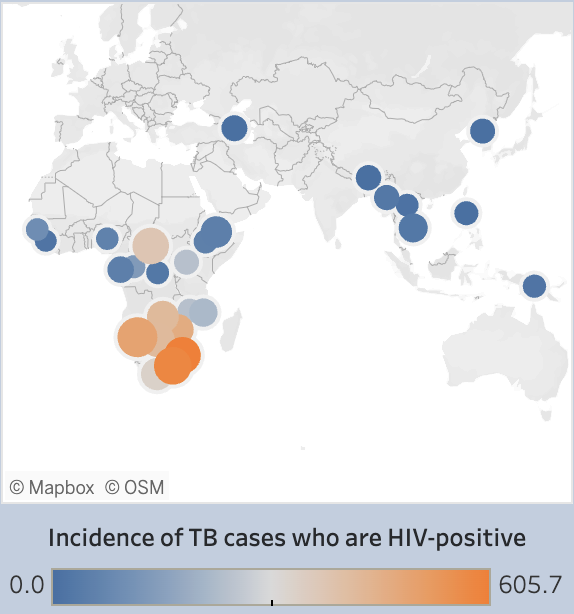

# Visualizing Tuberculosis(TB) Burden

## Project/Goals
- Use Tableau visualizations to summarize the metrics of worldwide tuberculosis burden as provided in the 'Tuberculosis_Burden_Countries' dataset.
- Use the visualized metrics to curate dashboards for exploring and answering important questions about TB burden.

## Process
### Explore and research dataset
With the TB_burden dataset is was important to understand the number of nulls in each column, to make sure agregate values that included some years/countries were not incorrectly compared to those that did not. This exploration of the dataset is python notebook that can be found [here](Data_exploration.ipynb). 
Research on Tuberculosis was necessary to understand the metrics of the diseease, as well as common metrics for a pandemic. This research was summarized into [A Brief Overview of Tuberculosis](A%20Brief%20Overview%20of%20Tuberculosis.pdf).
### Sketch potential visuals and dashboard compositions
Before any visuals can be created, they need to be intnentionally designed. Potential visuals were hand sketched to identify those that might have good synergy in describing metrics. These visuals were then combined in dashboard layout sketches to explore ideal compositions. Finally, the dashboard sketches were converted into container hierarchies for efficient translation of the dashboard designs into Tableau.
### Create visuals
Implementation of sketches into the visuals that would make up each dashboard yielded the following charts:
#### Prevalence, Incidence, and Mortality Geography

#### Prevalence, Incidence, and Mortality Rates

#### Highest Incidence Countries - HIV Proportional Stacked Bars

#### Mortality and Incidence rates of HIV+ cases

#### Highest Incidence Countries - HIV Proportional Geography

### Create dashboards
#### World Tuberculosis Burden - Prevalence, Incidence, Mortality
The first dashboard focuses on comparing prevalence, incidence, and mortality rates of TB both numerically and geographically. A static image can be seen below, or the dashboard can be interacted with as intended [here](https://public.tableau.com/views/WorldTuberculosisBurden-PrevalenceIncidenceMortality/PrevalenceIncidenceMortality?:language=en-US&:display_count=n&:origin=viz_share_link).

#### World Tuberculosis Burden - Impact of HIV/AIDS
The second dashboard focuses on the impact of HIV/AIDS on Tuberculosis burden. Care was taken to design this dashboard with an embed-friendly width. A static image can be seen below, or the dashboard can be interacted with as intended [here](https://public.tableau.com/views/WorldTuberculosisBurden-ImpactofHIVAIDS/ImpactofHIV?:language=en-US&:display_count=n&:origin=viz_share_link).

### Check accessibility
Red/Green color blindness is a major concern when picking colors for descriptive visuals. Both dashboards were designed with this in mind, and run through red-green color blindness simulations to test whether the color themes would be effective for those with red-green color deficiency. The following visuals were generated:

The intentional design was successful, since the color elements of each dashboard are still effectively communicated.
### Report findings
The findings were reported as a presentation. and in the results section of this markdown (below).
## Results
While many conclusions can be drawn by exploring different value parameters on the dashboards, the most standout conclusions are as follows:
- The height of the Tuberculosis pandemic occured in the mid 2000s, and the burden has been consistently decreasing since.
- Rates of HIV+ TB incidence drive mortality rates of TB.
- In the top 50 countries with the highest incidence rate of TB, rates of incidence excluding cases with HIV/AIDS are relatively similar.

Altogether, this indicates that a focus on reducing the burden of HIV/AIDS would translate directly into a reduction of TB burden, both in the metrics of incidence and mortality.
## Challenges 
Tableau Public is a cloud-based service that requires saving by uploading the file to Tableau Public servers. The process of saving to the Tableau servers can cause the Tableau desktop app to quit unexpectedly (crash) and lose your unsaved progress. 

To avoid losing a large quantity of work it is advisable to save to Tableau Public frequently, but this means dealing with more frequent crashes, a recurring login process, and the waiting time for server connection/upload.

## Future Goals
Some popular Tableau Public dashboards use a standard width and long length to essentially stack dashboards, allowing them to be experienced by scrolling (similar to a website). This format allows periodic placements of text to explain dashboards and components, presenting the dashboards in a self-explanatory report-like format. This dashboard from Luke Abraham is an example of this format: [You've Been Denied | Licence Plates](https://public.tableau.com/views/YouveBeenDeniedLicensePlates/YouveBeenDenied?:language=en-US&:display_count=n&:origin=viz_share_link)

Other popular dashboards present like the Tableau story feature, where they contain interactable arrows that lead through dashboards and interspersed explanations. This allows the dashboards to be presented once again, in a self-explanatory report-like format. This dashboard by Sarah Pellet and Anne-Sophie Periera De Sa is a great example of this format: [Ted Lasso Pop Culture References](https://public.tableau.com/views/TedLassoPopCultureReferences_16781149756030/TedLassoReferences?:language=en-US&:display_count=n&:origin=viz_share_link)

Either of these two formats would be the best future for the dashboards in this project.
